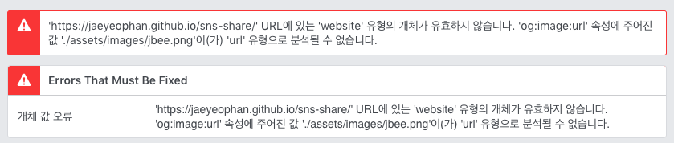
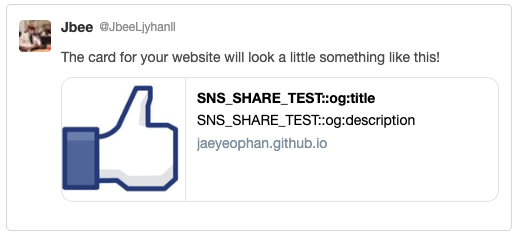
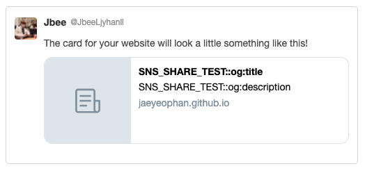

# SNS-SHARE


## OG (Open Graph)

> [The Open Graph protocol](http://ogp.me/)


`<meta>` 태그에 넣어주는 property를 말한다.

```html
<meta property="og:url" content="[String]" />
<meta property="og:type" content="[String]" />
<meta property="og:title" content="[String]" />
<meta property="og:description" content="[String]" />
<meta property="og:image" content="[String]" />
<meta property="og:site_name" content="[String]" />
```

### Tips for you

#### Tip 1. og:image는 relative path로 지정할 수 없음.



(TBD)

## Twitter sharing



twitter에서는 `og:-*`을 지원하고 있는데, 대신 다음과 같은 meta 태그를 추가해둬야 한다.
```html
<meta name="twitter:card" content="summary" />
```

### Twitter Content Type

여기에서 `content`에 들어갈 수 있는 content type으로는 총 4가지 종류가 있다.

- `summary`
	- 작은 thumbnail 이미지와 함께 title, description, url 노출
- `summary_large_image`
	- 	큰 thumbnail 이미지와 함께 title, description, url 노출
- `player`
	- 동영상을 공유할 때 사용하는 content type
- `app`

Content Type을 지정해주면 기본적으로 og 태그에 지정된 속성들을 가져간다.

### ‘summary’의 함정



`<og:image>`를 제대로 지정해줬음에도 불구하고 thumbnail 이미지가 제대로 노출되지 않은 이슈가 있다. 크롤러가 가져올 수 있는 이미지 용량에 제한이 있기 때문이며 이는 작은 이미지로 바꾸면 잘 노출된다. 공식 문서에서는 다음과 같이 말하고 있다.

> **The dimensions of the image are smaller than the recommended size.** We suggest that images are a minimum of 144 x 144 pixels in size.

따라서 이미지 크기를 조정해야 한다. 이 때, Facebook, twitter 두 SNS에서 다른 thumbnail image를 노출하고 싶다면 twitter 관련 meta 태그를 하나 추가해줘야 한다.

```html
<meta name="twitter:image" content="[IMAGE_FILE]"/>
```

기본적으로 Facebook은 `og:image`에 지정되어 있는 이미지 파일을 크롤링해가고 twitter는 `twitter:image`에 있는 이미지 파일을 크롤링해간다.

## Useful References

- https://developer.twitter.com/en/docs/tweets/optimize-with-cards/guides/troubleshooting-cards.html
- https://github.com/joshbuchea/HEAD


#### Facebook

- [Debugger](https://developers.facebook.com/tools/debug/)

#### Twitter

- [Card Validator](https://cards-dev.twitter.com/validator)

#### ETC

- [Favicon Generator](https://favicon.io)
